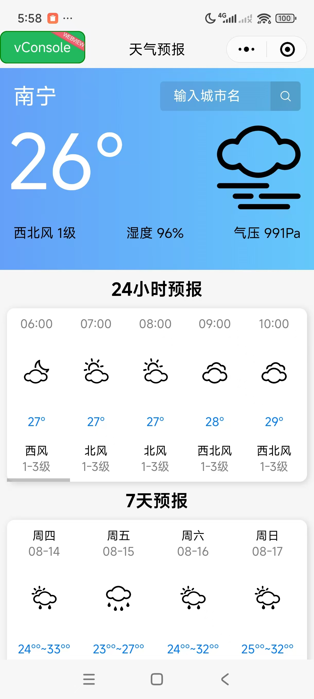
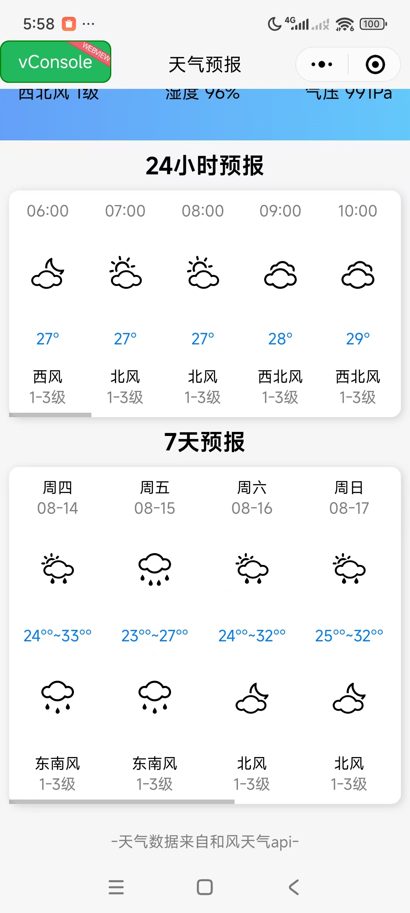

# 个人作品集 · 前端开发

> 两个纯原生前端项目，用于简历展示。无框架依赖，重在原生 JavaScript + CSS 功底。

---

## 项目一：游戏官网（品牌形象页面）

一个品牌形象官网首页，以视频为核心载体，强调视觉冲击力和沉浸式浏览体验。

*加载页：文字进度条 → 自动进入主页面*

*主页面：一页式滚动，视频区域自动播放*

### 核心功能
- **加载动画**：页面进入时显示文字进度条，加载完成后自动播放品牌视频
- **滚动视频播放**：一页式滚动布局，滚动到视频区域自动播放，播完后几秒自动切换到下一个
- **缩略图联动**：侧边视频缩略图列表随播放进度联动滚动，当前播放的视频缩略图自动居中
- **动效增强**：使用 Animate.css 库实现入场动画和交互动效

### 技术栈
- 原生 HTML5 + CSS3 + JavaScript (ES6+)
- Intersection Observer API（滚动检测）
- Animate.css（动效库）
- 无第三方依赖，纯前端实现

### 项目亮点
- 纯三件套实现，代码可移植性强
- 缩略图联动滚动算法自行设计
- 视频播放与滚动交互无缝衔接

---

## 项目二：微信天气小程序

一款简洁的天气预报小程序，支持定位和城市搜索。

*首页：实时天气展示*

### 核心功能
- 自动定位当前位置并显示实时天气
- 搜索城市切换查询
- 显示当日气温、天气状况、风力等信息

### 技术栈
- 微信小程序原生开发
- 和风天气 API（第三方天气数据接口）

### 项目亮点
- 原生小程序开发，无额外框架
- API 请求封装，代码结构清晰

---

## 关于我

目前正在系统学习 **Vue3**，学习笔记和练习代码持续更新中。

- GitHub：[https://github.com/bagubi]
- 求职意向：前端开发工程师（Vue / React 方向）
